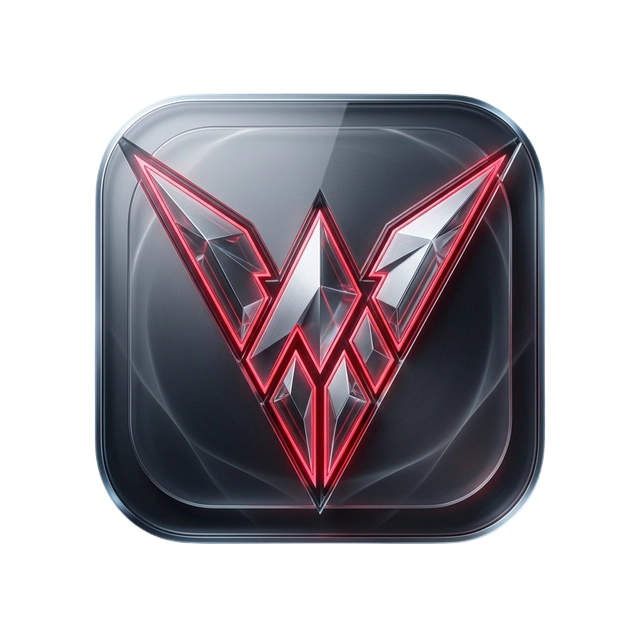

# 🦅 Talon (OpenClaw Manager)

> **极简、极致、极速。** 为 [OpenClaw](https://github.com/imfing/openclaw) 量身打造的桌面安装器与图形化管理终端。

[]()
[]()
[]()
[]()

---

> [!IMPORTANT]
> **🚀 声明：本项目是一个纯正的 [Vibe Coding](https://x.com/search?q=Vibe%20Coding) 产物。**  
> 所有的代码逻辑、架构设计以及视觉美学均由开发者通过与 AI 的“灵感共振”实时生成。目前项目仍处于 **WIP (Work In Progress)** 阶段，功能可能随时起飞也可能随时坠毁，请带着探索的心态使用。

---

## ✨ 简介

**Talon** 是 OpenClaw 官方 CLI 的高度集成的图形化外壳。我深知命令行对普通用户可能存在门槛，加之在看到各种claw的封装版小龙虾，亲身测试后又对比原版可能出现各种各样奇怪的情况。因此我像着开发个 Talon，旨在让每个人都能通过几秒钟的点击，在桌面上拥有属于自己的私有 AI 助手网关，当然弃坑卸载也是马上的事！



## 🚀 核心特性

- **🛡️ 零配置安装**：全自动化检测 Git、Node.js 及 PNPM 环境。如果你的 Node.js 版本过低，Talon 甚至会帮你静默升级（通过 NVM）。
- **🏗️ 智能环境注入**：首创 PNPM 动态路径注入技术，完美解决 macOS/Linux 下 Electron 无法识别全局二进制文件的问题。
- **🔑 深度 OAuth 适配**：
  - **通义千问 (Qwen)**：一键启用 `qwen-portal-auth` 插件并跳转 OAuth。
  - **OpenAI Codex**：原生支持 GitHub Copilot 授权流。
  - **Google Gemini**：支持最新 Gemini 终端授权。
- **🕯️ 极光美学 UI**：基于 Framer Motion 的 atmospheric/aurora 视觉风格，支持玻璃拟态效果及丝滑的动态反馈。
- **♻️ 配置安全**：在每次敏感修改前自动备份 `openclaw.json`，支持一键还原。

## 🛠️ 技术架构

Talon 采用了尖端的 Electron 落地实践：
- **Frontend**: React + Vite + Framer Motion + Lucide Icons.
- **Backend**: Electron Main 进程深度封装 `child_process` 流式输出。
- **CLI Proxy**: 完美的 CLI 实时日志流解析与 URL 捕获逻辑。

> [详细架构设计文档请见 `docs/architecture.md`](docs/architecture.md)

## 📥 快速开始

### 开发者模式

```bash
# 克隆仓库
git clone https://github.com/zmnsQ/talon-manager.git

# 进入目录
cd talon-manager

# 安装依赖
pnpm install

# 启动开发服务器
npm run dev
```

### 构建应用

```bash
npm run build
```

## 📸 界面预览

| 环境自检 | 授权向导 | 仪表盘 |
| :--: | :--: | :--: |
|  |  |  |

## 🤝 贡献信息

欢迎提交 Issue 或 Pull Request！我们期待你的建议，让 Talon 变得更加锋利。

## 🙏 鸣谢 (Acknowledgments)

- [Electron](https://www.electronjs.org/) - 优秀的跨平台桌面应用开发框架。
- [OpenClaw](https://github.com/imfing/openclaw) - 强大的私有 AI 助手网关核心。

## 📄 开源协议

本项目采用 [MIT](LICENSE) 协议。

---

> Created with ❤️ by Talon Team. 
> Talon is independent of the OpenClaw core but built to support its ecosystem.
